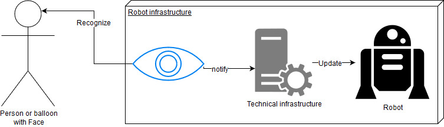
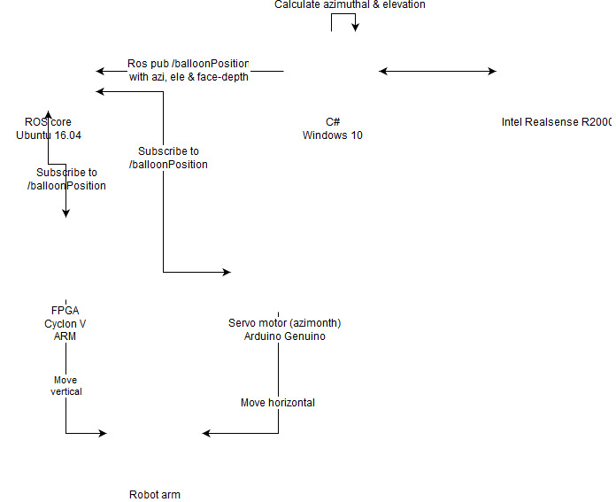

# hackathon_17_face_arm_tracking
Balloon Project of the Roboy Hackathon 2017 in Munich

## Use Case

Built with draw.io ([assets/UseCase.xml](XML-asset))

## Systems

Built with draw.io ([XML asset](assets/System.xml))

### Face-Tracking System

> In this system, the 

 - OS: Windows 10 (on a Lenovo T460p)
 - Programming languages: C#
 - IDEs: Visual Studio 2015 Community Edition
 - Project: [face_tracking_intel_realsense](./face_tracking_intel_realsense)
 - Used objects: 
	- Intel F2000
	- Robot arm
 
### Ros-Core

 - OS: Ubuntu 16.04
 - Programming language: C++, ROS, Python
 - IDEs: (vim)
 - Project: [ros_core](./ros_core)

### Robot arm

Too complex to explain, just ask the middleware team.

### other components

These components can be seen in the system diagram and the Genuino installation is described in the ros_core project. 

### Rotation construction

Can be found in the assets folder.